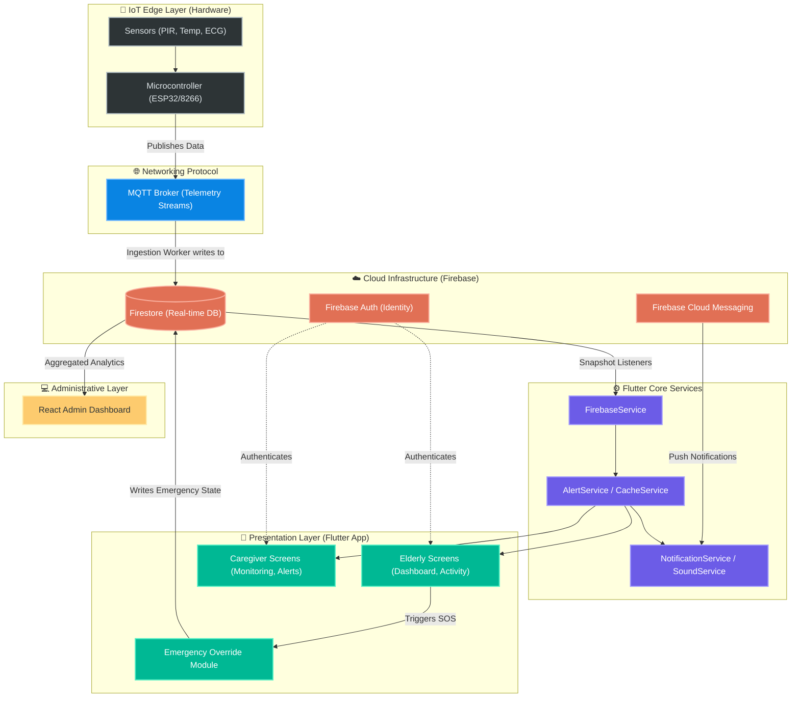
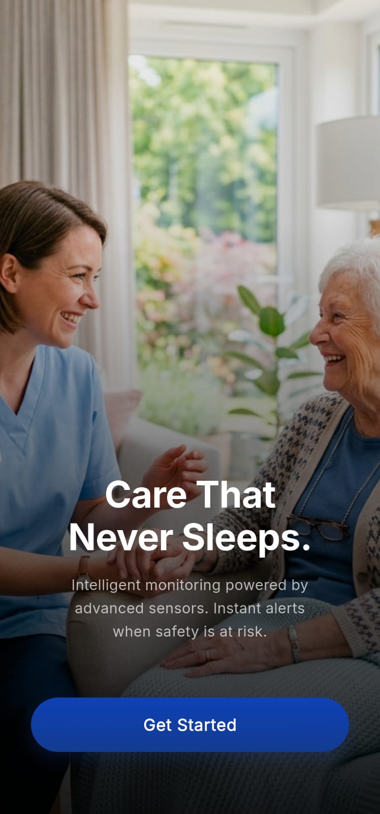
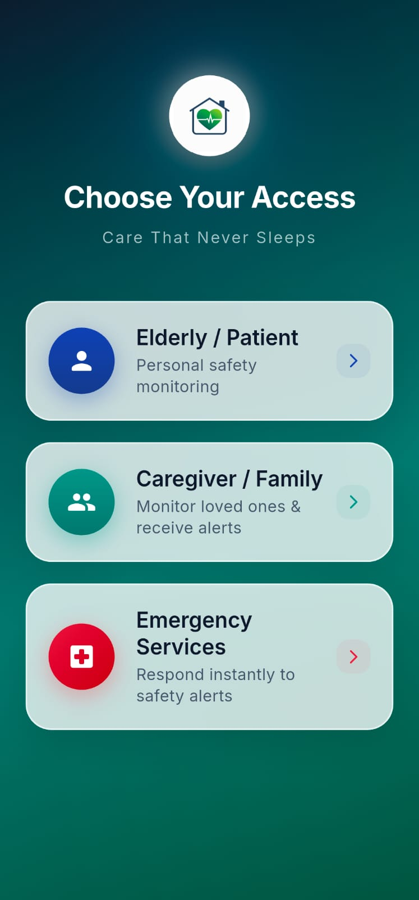
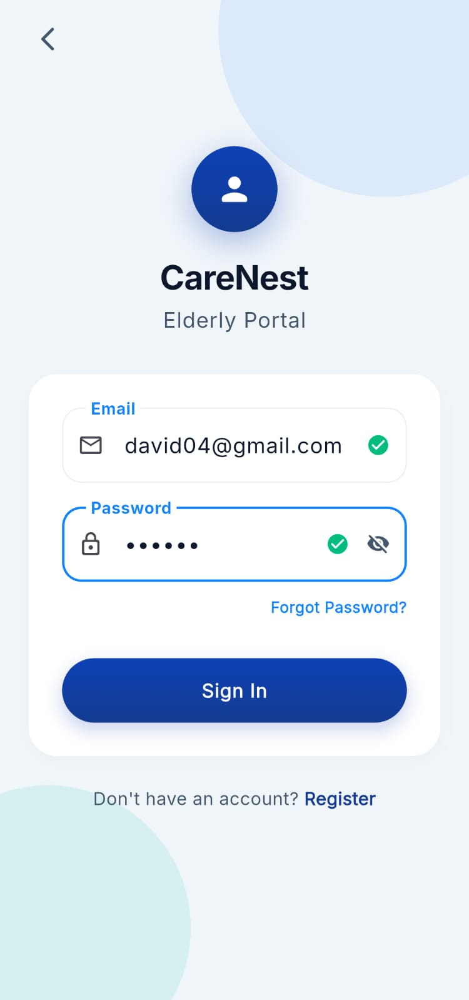
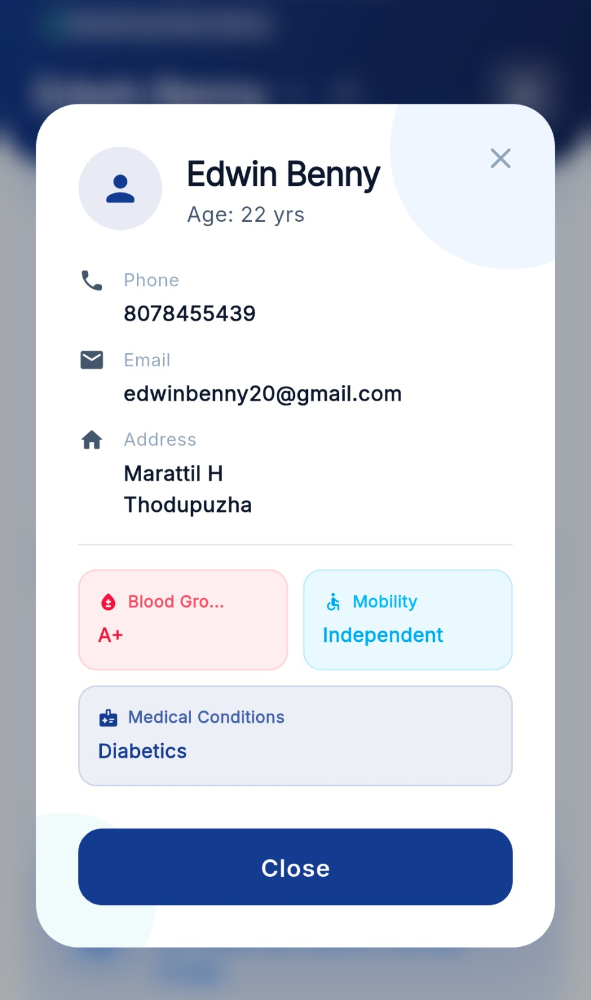
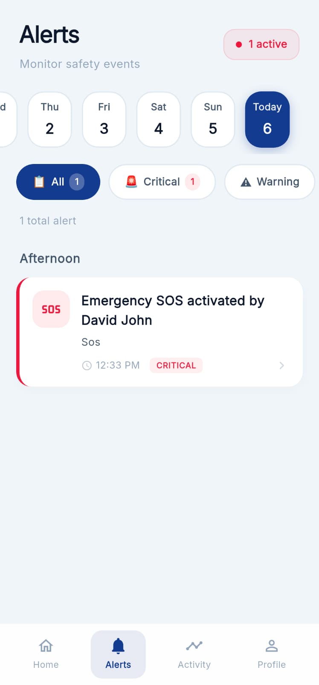
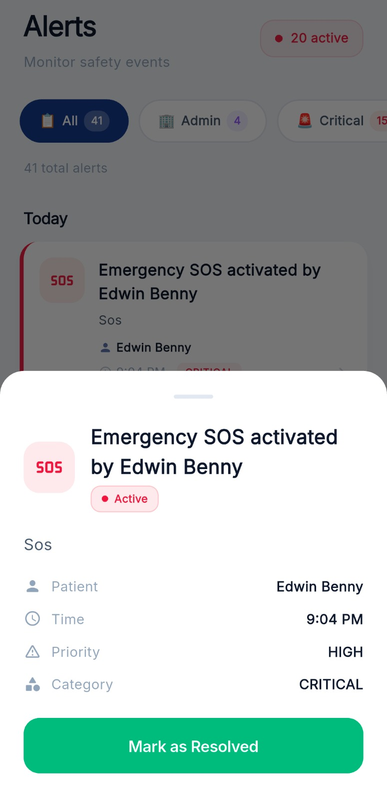

<div align="center">

# 🏥 CareNest
### Next-Generation Ambient Assisted Living & Healthcare System

[](https://flutter.dev)
[](https://firebase.google.com/)
[](https://reactjs.org/)
[](https://nodejs.org/)
[](https://mqtt.org/)
[](https://opensource.org/licenses/MIT)

*An enterprise-grade, real-time healthcare monitoring platform designed to empower elderly care through ambient intelligence, IoT integration, and responsive data analytics.*

[Report Bug](https://github.com/eldhoaby/CareNest-App/issues) · [Request Feature](https://github.com/eldhoaby/CareNest-App/issues) · [Explore Documentation](./docs/README.md)

</div>

---

## 📖 Why CareNest?

### The Problem Statement
As the global population ages, the demand for continuous, non-intrusive elderly care has skyrocketed. Traditional caregiving is often resource-intensive and reactive rather than proactive. There is a critical need for a system that allows seniors to live independently while ensuring their safety and health are constantly monitored.

### Real-World Impact
**CareNest** bridges the gap between independent living and necessary medical oversight. By leveraging **Ambient Assisted Living (AAL)** technologies, the system minimizes hospital readmissions, detects emergencies instantly, and provides immense peace of mind to families and caregivers. 

### Research & Healthcare Relevance
Developed as a robust university capstone project, CareNest implements concepts from modern gerontology and smart-home IoT. It utilizes a microservices-inspired architecture to handle real-time sensor streams (fall detection, temperature, motion) making it highly relevant for clinical trials, smart hospitals, and modern assisted living facilities.

---

## ✨ Project Highlights & Key Achievements

- 🔄 **Real-Time Monitoring:** Sub-second latency data synchronization across all clients using **Firestore** and **WebSockets**.
- 📡 **IoT Integration:** Seamless hardware-software handshakes via **MQTT** protocols to process ambient sensor data.
- 📱 **Cross-Platform Mobile App:** A unified, accessible Flutter application optimized for seniors and detailed enough for caregivers.
- 🛡️ **Role-Based Admin System:** A secure React web portal for administrators to manage users, devices, and analyze health trends.
- 🚨 **Emergency Alert Workflow:** Automated threshold-based alert dispatch system utilizing Firebase Cloud Messaging (FCM).

---

## 🛠 Tech Stack & Integration

*(Keywords: `Flutter`, `React.js`, `Node.js`, `Firebase Authentication`, `Firestore`, `MQTT`, `Cross-platform development`, `Ambient Assisted Living`, `IoT healthcare system`, `Responsive admin dashboard`, `Real-time monitoring`)*

| Domain | Technology | Description |
| :--- | :--- | :--- |
| **Mobile App** | Flutter, Dart | Cross-platform application tailored for Elderly & Caregivers. |
| **Admin Portal** | React.js, Tailwind CSS | Responsive, data-rich dashboard for system administrators. |
| **Backend API** | Node.js, Express.js | RESTful APIs, webhook handlers, and business logic execution. |
| **Real-time Engine** | Firebase Firestore | NoSQL cloud database with real-time state listeners. |
| **Authentication** | Firebase Auth | Secure identity management (OAuth, Multi-factor). |
| **IoT Comm.** | MQTT / Mosquitto | Lightweight messaging protocol for sensor data streams. |

---

## ⚙️ System Requirements

| Component | Minimum Version | Notes |
| :--- | :--- | :--- |
| **Flutter SDK** | 3.19.0+ | Required for mobile client compilation. |
| **Node.js** | v18.x (LTS) | Required for the backend and Admin portal. |
| **Firebase** | Blaze Plan | Required for Cloud Functions & unlimited Firestore reads. |
| **OS Targets** | iOS 12.0+, Android 8.0+ | Mobile app supported platforms. |

---

## 📐 Architecture Overview

The CareNest platform is designed for high availability and fault tolerance, separating concerns across distinct layers:

1. **The Edge (IoT Sensors):** PIR, Temp, and health monitors publish telemetry data.
2. **Data Layer (Firebase/Firestore):** Acts as the centralized, real-time single source of truth.
3. **Application Layer (Flutter):** Subscribes to document snapshots to render UI dynamically based on the elder's state.
4. **Administrative Layer (React & Node):** Handles heavy aggregation, user management, and secure webhook processing.



<div align="center">
  <p><i>Refer to the <a href="./docs/system-design.md">Detailed System Design</a> for layer breakdowns and scalability factors.</i></p>
</div>

---

## 📊 Repository Statistics & Engineering Metrics

- **Architecture Style:** Decoupled Client-Server with Event-Driven Data Synchronization.
- **Scalability:** Stateless backend APIs (Node.js) horizontally scalable on Render; Serverless scaling for database (Firestore).
- **Security Considerations:** Enforced Firestore Security Rules, HTTPS/WSS encryption in transit, JWT-based authentication.

---

## 🚀 Getting Started

### 1. Prerequisites
Ensure your development environment is prepared:
* [Flutter SDK](https://docs.flutter.dev/get-started/install) installed and added to PATH.
* [Node.js](https://nodejs.org/) installed.
* Firebase CLI installed (`npm install -g firebase-tools`).

### 2. Installation
```bash
# Clone the repository
git clone https://github.com/eldhoaby/CareNest-App.git
cd CareNest-App

# Fetch Flutter dependencies
flutter pub get
```

### 3. Environment Configuration
Create a `.env` file in the root of your project:
```env
FIREBASE_API_KEY=your_api_key
FIREBASE_PROJECT_ID=carenest-app
FIREBASE_SENDER_ID=your_sender_id
# Add other required variables as specified in /docs/setup.md
```

### 4. Running Locally
```bash
# Run the mobile application
flutter run
```

---

## 📦 Deployment

CareNest is built for modern cloud-native deployment:

* **Frontend Admin Portal:** Deployed via **Vercel** with continuous integration on the `main` branch.
* **Backend API:** Hosted securely on **Render** (Node.js service).
* **Mobile App:** Configured for CI/CD generation of App Bundles (AAB) and IPAs.

Detailed deployment guides can be found in `docs/deployment.md`.

---

## 📸 Application Showcases

*(High-fidelity screenshots of the application in action)*

<div align="center">
  <table>
    <tr>
      <td align="center"><b>Welcome Screen</b></td>
      <td align="center"><b>Role Selection</b></td>
      <td align="center"><b>Login Page</b></td>
    </tr>
    <tr>
      <td></td>
      <td></td>
      <td></td>
    </tr>
    <tr>
      <td align="center"><b>Patient Info</b></td>
      <td align="center"><b>Emergency Alert</b></td>
      <td align="center"><b>Alert Resolved</b></td>
    </tr>
    <tr>
      <td></td>
      <td></td>
      <td></td>
    </tr>
  </table>
</div>

---

## 📚 Comprehensive Documentation

Explore the `docs/` folder for in-depth technical specifications:

- 🗺️ [System Design & Architecture](docs/system-design.md)
- 🗄️ [Database Schema](docs/database-schema.md)
- 🔒 [Security Architecture](docs/security-architecture.md)
- ⚙️ [Setup Guide](docs/setup.md)
- 🚀 [Deployment Guide](docs/deployment.md)
- 📡 [IoT Architecture](docs/iot-architecture.md)

---

## 🤝 Contributing & Community

We believe in the power of open source to drive healthcare innovation forward. 
Please read our [CONTRIBUTING.md](CONTRIBUTING.md) to learn how to get involved, and adhere to our [CODE OF CONDUCT](CODE_OF_CONDUCT.md).

For vulnerability disclosures, refer to our [SECURITY.md](SECURITY.md).

---

## 📄 License

This project is licensed under the MIT License - see the [LICENSE](LICENSE) file for details.

<div align="center">
  <b>Architected with ❤️ for a safer, smarter tomorrow.</b>
</div>
