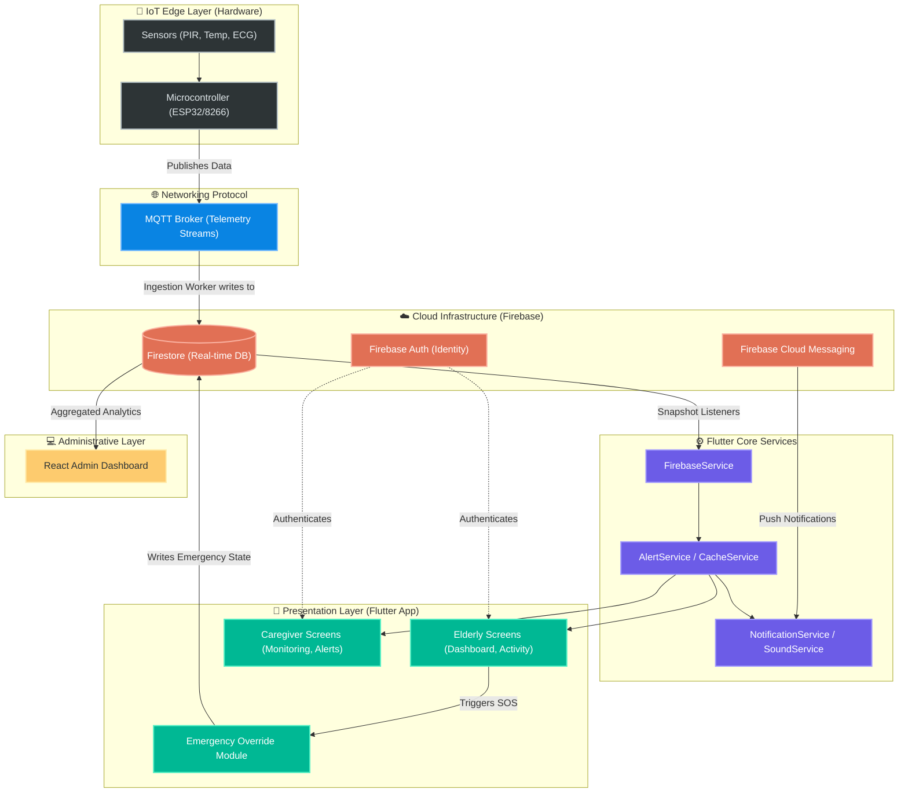

# 🏗 System Design & Architecture

CareNest implements a highly responsive, event-driven architecture designed to ensure high availability and sub-second latency for critical emergency alerts. The system utilizes a decoupled microservices-inspired approach.

## Detailed Architectural Flow

The following diagram illustrates the flow of data across the different layers of the CareNest ecosystem, derived directly from the application's source code architecture.

## Layer Breakdown

### 1. Presentation Layer (`lib/screens`)
Separates concerns via role-based routing. The `Elderly` module provides an accessible, simplified interface with a prominent SOS trigger. The `Caregiver` module offers high-fidelity data visualization and alert management capabilities.

### 2. Core Services Layer (`lib/core/services`)
- **`FirebaseService`:** Acts as the singleton bridge between the UI and cloud infrastructure, managing active snapshot subscriptions to prevent memory leaks.
- **`AlertService` & `GlobalAlertCacheService`:** Houses the business logic for evaluating thresholds. It intercepts changes in the `SensorDataModel` and, if an anomaly is detected, constructs an `AlertModel`.
- **`NotificationService` & `SoundService`:** Handles local OS-level push notifications and audio alerts ensuring the caregiver is immediately notified even when the app is backgrounded.

### 3. Data Entities (`lib/models`)
Data serialization is strictly typed to ensure integrity over the wire:
- `UserModel` for identity.
- `SensorDataModel` for telemetry logs.
- `AlertModel` for incident tracking and resolution state.

### 4. Scalability Factors
- **Stateless Backend:** Any Node.js processing workers are stateless, allowing for horizontal pod autoscaling based on MQTT traffic load.
- **Serverless Database:** Firestore automatically scales read/write capacity based on active application connections.
