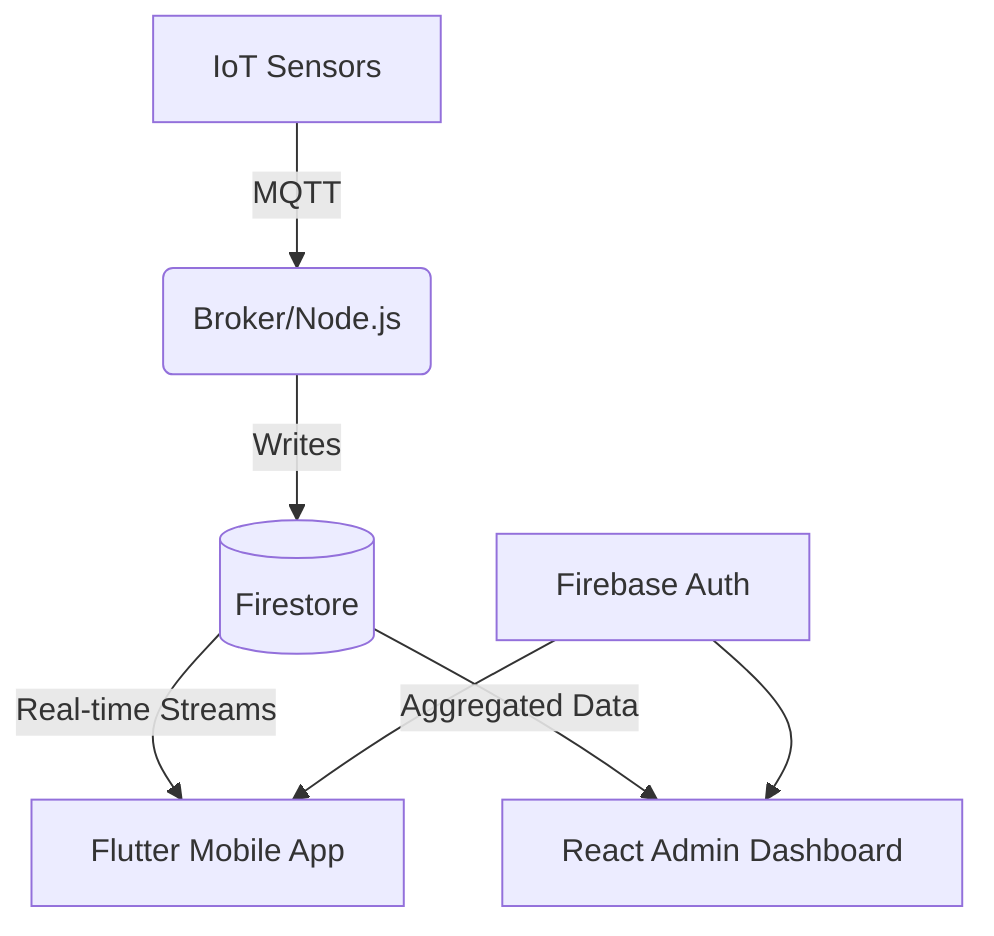

# 🏗 System Design & Architecture

CareNest implements a decoupled, event-driven microservices architecture to ensure high availability and sub-second latency for emergency alerts.

## High-Level Architecture
1. **IoT Edge Tier:** Sensors communicating via MQTT.
2. **Data Services Tier:** Firebase (Firestore + Auth).
3. **Application Tier:** 
   - Mobile Client (Flutter)
   - Admin Client (React)
4. **Backend Services Tier:** Node.js processing workers.

*(Include Mermaid Diagram Here)*

## Scalability Factors
- **Stateless Backend:** The Node.js services are stateless, allowing for horizontal pod autoscaling.
- **Serverless Database:** Firestore automatically scales read/write capacity based on active connections.
